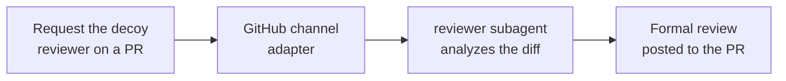

import { Callout } from 'fumadocs-ui/components/callout'

Wire the GitHub channel into your repo, request the agent as a reviewer on a pull request, and it runs a deep, line-anchored review through the bundled `reviewer` subagent and posts a formal GitHub review back. No human triggers it; the review request is the trigger.

<Callout type="info" title="This runs in production">
  
  [`@typeey`](https://github.com/typeey) — TypeClaw's own mascot agent — reviews pull requests on
  [`typeclaw/typeclaw`](https://github.com/typeclaw/typeclaw) exactly this way: request it as a reviewer, it spawns the
  `reviewer` subagent, posts a formal review. The recipe below is the setup behind that live example.
</Callout>

This recipe stitches together the GitHub channel adapter, the `reviewer` subagent, a public tunnel for the webhook, and — under GitHub App auth — the decoy-reviewer pattern. Each piece has its own page; this is the assembly.

## How it works

You request the reviewer; the agent does the rest. Under GitHub App auth you request a [decoy account](#set-up-the-decoy-reviewer) that stands in for the bot — that's what fires the webhook. The `reviewer` subagent then analyzes the diff and posts a formal review back to the PR.



The sections below set up each hop.

## Wire the GitHub channel

You don't hand-edit `typeclaw.json` for this. Run the wizard from inside your agent folder:

```sh
typeclaw channel add github
```

It walks the whole setup interactively:

- **Auth** — pick a fine-grained PAT or a GitHub App. It collects the token (or App ID + private key) and writes them to `secrets.json`, never to `typeclaw.json`.
- **Tunnel** — GitHub needs a public URL for webhooks. The wizard offers Cloudflare Quick Tunnel (no signup, recommended), a named tunnel, your own external URL, or none. Pick Quick and it provisions the tunnel for you.
- **Webhook port + secret** — defaults to `8975`; leave the secret blank and it auto-generates one.
- **Repos** — comma-separated `owner/repo` you want the agent to watch.

When it finishes, it **installs the repository webhooks for you** and enables the adapter. If the container is running, it offers to restart so the change takes effect; otherwise `typeclaw start` picks it up. See [Add a channel](/docs/guides/first-channel) for the shared flow and the [`github` adapter reference](/docs/reference/github) for the config the wizard writes.

<Callout type="info" title="Or just ask the agent">
  If the agent is already running with an `owner` paired, you can skip the CLI and ask it in the TUI or a 1:1 DM — _"add
  the GitHub channel for `owner/repo` using App auth"_ — and let it run the same steps. The CLI is the deterministic
  path; the agent is the conversational one.
</Callout>

## Scope events to pull-request activity

The default GitHub event allowlist already covers reviews. If you want to narrow it to just the review path, the relevant events are `pull_request.review_requested`, `pull_request.review_request_removed`, `pull_request_review.submitted`, and `pull_request_review_comment.created` — keep `review_request_removed` so the agent still sees when a review request is withdrawn. Tell the agent to tighten `channels.github.eventAllowlist`, or adjust it and run `typeclaw reload`. See the [`github` adapter reference](/docs/reference/github) for the full event list.

<Callout type="info" title="App auth and the Contents permission">
  On a **public** repo an App only needs **Pull requests: read/write** to read the diff and post reviews. On a
  **private** repo the agent also needs **Contents: read** — `git clone` (and any raw file-tree access) of a private
  repo fails with 403/404 without it; **Metadata: read** alone lets the App _see_ the repo but not read its files. Grant
  **Contents: write** _only_ if the agent will also push fix branches — GitHub bundles branch creation into that scope,
  so there's no narrower one. Keep a ruleset on `main` that requires pull requests, and the bot opens branches and PRs
  without ever touching `main` directly. The wizard's permission note lists exactly what to enable.
</Callout>

<Callout type="warn" title="The preflight won't catch a missing Contents grant">
  TypeClaw's App permission preflight only checks permissions tied to your configured `eventAllowlist` (issues, pull
  requests, discussions), so a private-repo reviewer missing **Contents: read** passes preflight cleanly and then fails
  at runtime when the agent tries to clone or read files. If reviews on a private repo error with "Resource not
  accessible by integration," add **Contents: read** to the App.
</Callout>

## Set up the decoy reviewer

This is the step everyone misses under App auth. **A GitHub App cannot be added as a pull-request reviewer.** The `requested_reviewer` field on a `pull_request.review_requested` webhook only ever holds a real **user** account; the App actor `slug[bot]` is not one, so GitHub never emits a review request targeting an App. The same is true for assignees and `@`-mentions.

The fix is a **decoy user account that impersonates the App** — same display name, same avatar — that you request as the reviewer instead. By convention the decoy is named after the App's slug:

| App slug | Bot actor (posts comments) | Decoy user (you request this) |
| -------- | -------------------------- | ----------------------------- |
| `my-app` | `my-app[bot]`              | `my-app`                      |

So for an App whose bot actor is `my-app[bot]`, create a real GitHub user account with the login **`my-app`** and request **`my-app`** as the reviewer on any PR you want looked at. The adapter derives the decoy login by stripping `[bot]` from its own actor and matches the incoming `requested_reviewer.login` against it. Comments still post from the App identity, so the visible reviewer stays consistent.

This is exactly how `@typeey` works: the App's bot actor is `typeey[bot]`, so the decoy account is the real user [`@typeey`](https://github.com/typeey). Requesting `@typeey` on a PR is what wakes the agent.

<Callout type="warn" title="The decoy is the only review trigger">
  Requesting the decoy (or the bot's team) is the **only** thing that fires a review under App auth. There is no "review
  every opened PR" behavior — a `pull_request.opened` event lands as awareness-only context. The wake path is
  `review_requested`, not the assignee `assigned` field.
</Callout>

<Callout type="info" title="When the slug login was taken">
  The decoy-login derivation assumes the decoy account's login equals the App slug. If that username was unavailable and
  you registered `my-app-bot` / `myapp` / etc., see
  [/internals/github-decoy-reviewer](/docs/internals/github-decoy-reviewer) for the single seam where the login is
  computed.
</Callout>

A **PAT-backed** bot needs none of this: it's already a real user you can request by its exact login. Skip straight to the next section.

## The review runs

When the decoy is requested, the agent wakes and delegates the analysis to the bundled **`reviewer`** subagent — read-only tools, a `deep` model profile, and a 5-minute timeout. It's the right delegation target here: `explorer` runs on a fast model and stays shallow, and `operator` needs elevated permissions a public GitHub session doesn't have. The reviewer returns line-anchored findings the agent turns into a review payload. See [/reference/bundled-plugins](/docs/reference/bundled-plugins) for the subagent inventory.

You don't script any of this. The review request lands, the agent reads the diff, spawns the reviewer, and posts back on its own — the same loop `@typeey` runs on every requested PR.

## How the review gets posted

Conversational comments go back through the channel automatically. A **formal review** — approve, request-changes, or inline line comments — is posted through the `gh` CLI, which the adapter pre-authenticates with a `GH_TOKEN` minted for your configured repos. The agent handles this; the notes below are for when you're debugging its output.

<Callout type="warn" title="Single-quote the review body">
  When the agent posts with `gh api -f body='...'`, single quotes matter. Double quotes let bash run backticks in the
  markdown (command substitution) and collapse `\n` escapes — which silently corrupts a review body containing `` `code`
  `` spans. If a posted review reads as mangled, this is the first thing to check.
</Callout>

<Callout type="info" title="gh may be unauthenticated in-container">
  If `gh` prompts for `gh auth login` inside a review session, the agent derives App installation auth from
  `secrets.json`: the App id is `channels.github.auth.appId` and the RSA signing key is
  `channels.github.auth.privateKey.value` — the `.value`, not the surrounding `privateKey` object.
</Callout>

## Lock down who can trigger it

Inbound GitHub authors resolve to a role like any other channel. Keep public participants on `guest` with just `channel.respond`, and reserve privileged actions (pushing branches, scheduling cron) for `owner`. To pair yourself as `owner`, run `typeclaw role claim --as owner` and follow the prompt — or, if you're already paired, ask the agent to grant a role via its `grant_role` tool from the TUI or a DM. The review path itself only needs read access plus the ability to post, so a stranger requesting the decoy gets a review — but can't make the agent push to your repo. See [/concepts/permissions-model](/docs/concepts/permissions-model) for why provenance is enforced at the tool boundary.

---

Next: [Schedule a job](/docs/guides/first-cron) — pair the reviewer with a cron prompt to groom issues or summarize PR activity on a schedule.
